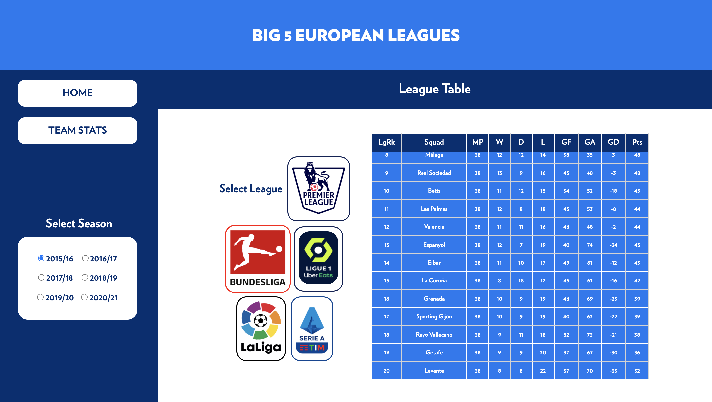

# Big-Five-European-League-Dashboard(Flask, Plotly, Pandas, HTML, CSS)

## Introduction
This application is built using data-sets from the FBREF website. These data-sets consist of season wise stats for all teams and players in the Big 5 European League. The Big 5 European League consists of the Premier League, Bundesliga, La Liga, Serie A, and Ligue 1. Using this data we are able to create various interactive visualization, and tables based on certain queries for teams in the Big 5 League.

## Uses
Dashboard to view season wise stats of teams in the big 5 league from 2015 to 2020.

## Requirements
* Flask
* Pandas
* Plotly
* Dash

## Developers
* Dylan Dias - @dylandias99 - https://github.com/dylandias99

## Screenshots
### Introduction 

### Various Plots

